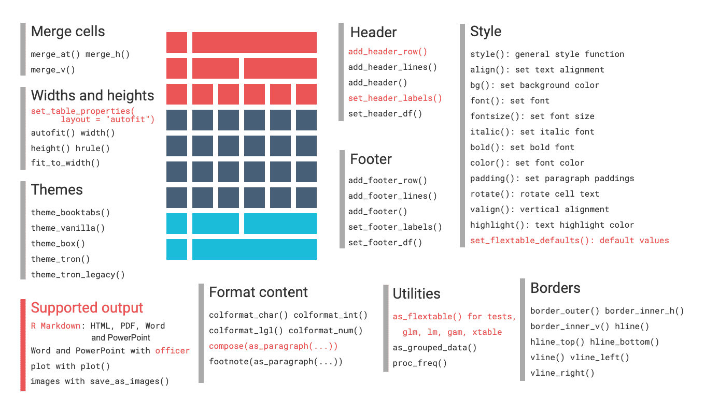

flextable R package
================

<!-- README.md is generated from README.Rmd. Please edit that file -->

[](https://github.com/davidgohel/flextable/actions)
[](https://CRAN.R-project.org/package=flextable)


**The user documentation is available here**:
<https://ardata-fr.github.io/flextable-book/>


The flextable package provides a framework for easily create tables for
reporting and publications. Tables can be easily formatted with a set of
verbs such as `bold()`, `color()`, they can receive a header of more
than one line, cells can be merged or contain an image. The package make
it possible to build any table for publication from a `data.frame`.

``` r
set_flextable_defaults(
  font.family = "Arial", font.size = 10, 
  border.color = "gray")

flextable(head(cars)) %>% 
  bold(part = "header") %>% 
  add_footer_lines("The 'cars' dataset")
```

Tables can be embedded within HTML, PDF, Word and PowerPoint documents
from R Markdown documents and within Microsoft Word or PowerPoint
documents with package officer. Tables can also be rendered as R plots
or graphic files (png, pdf and jpeg).

``` r
flextable(mtcars) %>% 
  theme_vanilla() %>% 
  save_as_docx(path = "mytable.docx")
```


A `flextable` object is a data.frame representation. An API is available
to let R users create tables for reporting and control their formatting
properties and their layout. The package provides functions that give
control over:

-   header, body and footer content
-   text, paragraphs, cells and border formatting of any element
-   displayed values



## Installation

``` r
install.packages("flextable")
```

You can get the development version from GitHub:

``` r
devtools::install_github("davidgohel/flextable")
```

## Resources

### Documentation

The help pages are in a bookdown located at:
<https://ardata-fr.github.io/flextable-book/>

Manuals are available at:
<https://davidgohel.github.io/flextable/reference/index.html>

A gallery of examples is available here:
<https://ardata-fr.github.io/flextable-gallery/gallery/>

### Getting help / questions

If you have questions about how to use the package, visit Stackoverflow
and use tags `flextable` and `r` [Stackoverflow
link](https://stackoverflow.com/questions/tagged/flextable+r)! You can
also use <https://github.com/davidgohel/flextable/discussions> to start
a discussion.

## Contributing to the package

### Code of Conduct

Anyone getting involved in this package agrees to our [Code of
Conduct](https://github.com/davidgohel/flextable/blob/master/CONDUCT.md).

### Bug reports

When you file a [bug
report](https://github.com/davidgohel/flextable/issues), please spend
some time making it easy for me to follow and reproduce. The more time
you spend on making the bug report coherent, the more time I can
dedicate to investigate the bug as opposed to the bug report.

### Contributing to the package development

A great way to start is to contribute an example or improve the
documentation.

If you want to submit a Pull Request to integrate functions of yours,
please provide:

-   the new function(s) with code and roxygen tags (with examples)
-   a new section in the appropriate vignette that describes how to use
    the new function
-   corresponding tests in directory `tests/testthat`.

By using rhub (run `rhub::check_for_cran()`), you will see if everything
is ok. When submitted, the PR will be evaluated automatically on travis
and appveyor and you will be able to see if something broke.
