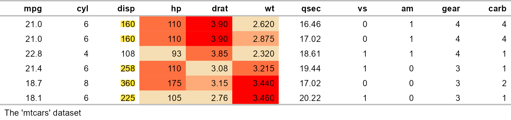

# flextable R package

[](https://github.com/davidgohel/flextable/actions)
[](https://CRAN.R-project.org/package=flextable)
[](https://app.codecov.io/gh/davidgohel/flextable)


The flextable package provides a framework for easily create tables for
reporting and publications. Tables can be easily formatted with a set of
verbs such as
[`bold()`](https://davidgohel.github.io/flextable/dev/reference/bold.md),
[`color()`](https://davidgohel.github.io/flextable/dev/reference/color.md),
they can receive a header of more than one line, cells can be merged or
contain an image. The package make it possible to build any table for
publication from a `data.frame` and provides sugar function
[`as_flextable()`](https://davidgohel.github.io/flextable/dev/reference/as_flextable.md)
to convert several R objects to a flextable, such as an object return
from [`table()`](https://rdrr.io/r/base/table.html) or a model.

Tables can be embedded within HTML, PDF, Word and PowerPoint documents
from R Markdown documents and within RTF or Microsoft Word or PowerPoint
documents with package officer. Tables can also be rendered as R plots
or graphic files (png).


``` r
flextable(mtcars) %>% 
  theme_vanilla() %>% 
  save_as_docx(path = "mytable.docx")
```

A `flextable` object is a data.frame representation. An API is available
to let R users create tables for reporting and control their formatting
properties and their layout. The package provides functions that give
control over:

- header, body and footer content
- text, paragraphs, cells and border formatting of any element
- displayed values

The package also offers a set of high-level functions that allow tabular
reporting of statistical models and the creation of complex cross
tabulations.

## Examples

``` r
library(flextable)
set_flextable_defaults(
  font.family = "Arial", font.size = 10, 
  border.color = "gray", big.mark = "")

ft <- flextable(head(mtcars)) |> 
  bold(part = "header") 
ft
```


``` r

ft |> 
  highlight(i = ~ mpg < 22, j = "disp", color = "#ffe842") |> 
  bg(j = c("hp", "drat", "wt"), 
     bg = scales::col_quantile(palette = c("wheat", "red"), domain =NULL)) |> 
  add_footer_lines("The 'mtcars' dataset")
```



``` r
ggplot2::diamonds[, c("cut", "carat", "price", "clarity", "table")] |> 
  summarizor(by = c("cut")) |> 
  as_flextable(spread_first_col = TRUE)
```


## Installation

``` r
install.packages("flextable")
```

You can get the development version from GitHub:

``` r
devtools::install_github("davidgohel/flextable")
```

## Resources

- User guide: <https://ardata-fr.github.io/flextable-book/>
- Manuals: <https://davidgohel.github.io/flextable/reference/index.html>
- Gallery of examples: <https://ardata.fr/en/flextable-gallery/>

## Bug reports

When you file a [bug
report](https://github.com/davidgohel/flextable/issues), please spend
some time making it easy for us to reproduce. If you take the time to
make the bug report consistent, it will be easier to fix.
